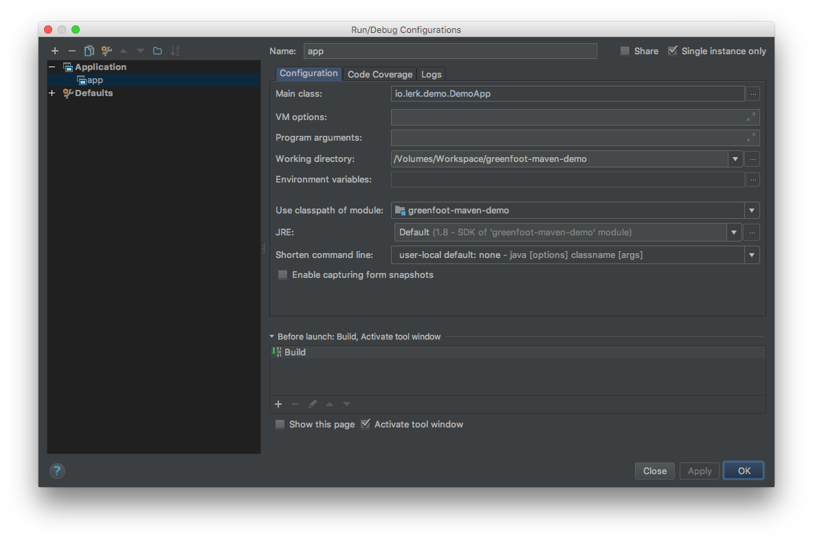

# Greenfoot Maven Demo

This is a simple Game showcasing Greenfoot development using Maven only.

To get more information on the process of developing without using the Greenfoot IDE, please read 
[DEVELOPMENT.md](DEVELOPMENT.md) or [the blogpost](https://blog.lerk.io/making-games-with-greenfoot-without-greenfoot/) I made, which is essentially the same.

## Motivation

Developing games with Greenfoot is extremely easy compared to other Java frameworks. Unfortunately you are kind of 
forced to use the toolset supplied by Greenfoot, which might be great for beginners but is just a pain if you are 
used to develop using a real IDE. Also using a IDE to develop, means that you can use that IDE's debugging tools, which 
is great because the Greenfoot tools only offer stepwise calling of the `act()` methods to do "*debugging*". 

## Gameplay

Since this is just a demo focusing on the technical side of this, the gameplay is hilariously simple and stupid.

The game is made for two players. Player one uses the arrow keys to control the moneybag and has the goal to reach 
the house. Player two uses `wasd` to control the thug, their goal is to reach the moneybag before it can reach the 
house. Once either goal is completed, the world has to be reset (or the game has to be restarted, call it what you 
want).

## Building/Running

There are many ways to build and run this, I will only cover two of them.

### Prerequisites

In any case, you'll need to clone this repo. You can do this by using any Git GUI Client or simply the command line:

```
$ git clone git@github.com:lfuelling/greenfoot-maven-demo.git
``` 

Also make sure, you have the following tools installed:

- Java 8 (JDK)
- Maven
- IntelliJ or any Java IDE (GUI way only)

### Command line

To build and run this, do the following in a terminal:

```
$ cd greenfoot-maven-demo
$ mvn clean install -DskipTests
$ java -jar target/greenfoot-maven-demo-1.0-SNAPSHOT-jar-with-dependencies.jar
```

If you try to use the jar without bundled dependencies it **won't work**!

### GUI

Open the `pom.xml` as a new project in IntelliJ or your IDE and switch on auto import for Maven.

If the import is done, create a new run configuration similar to the following:



You should now be able to run the game and even debug it!
